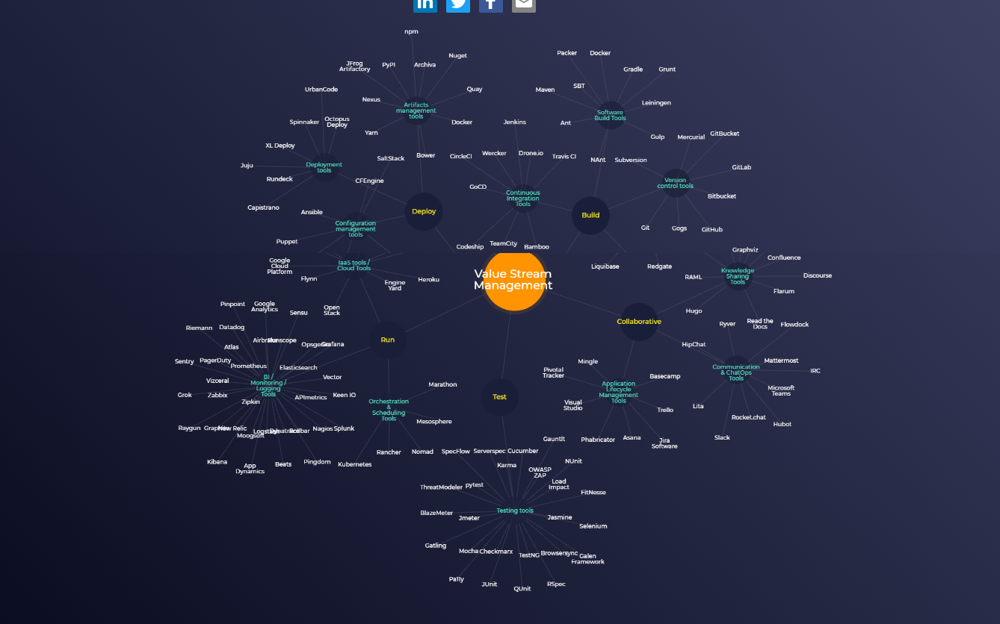
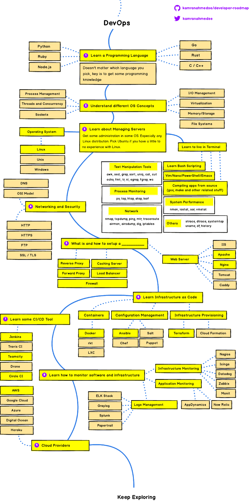

# Home Page

This guide contains all the useful links to various resources to help grow knowledge regards to all Dev-ops related stuff.





[https://xebialabs.com/assets/files/whitepapers/IT-Managers-Guide-to-DevOps.pdf](https://xebialabs.com/assets/files/whitepapers/IT-Managers-Guide-to-DevOps.pdf)

[https://stackify.com/top-devops-tools/](https://stackify.com/top-devops-tools/)

[https://xebialabs.com/assets/files/infographics/periodic-table-of-devops-tools-v3.pdf](https://xebialabs.com/assets/files/infographics/periodic-table-of-devops-tools-v3.pdf)













