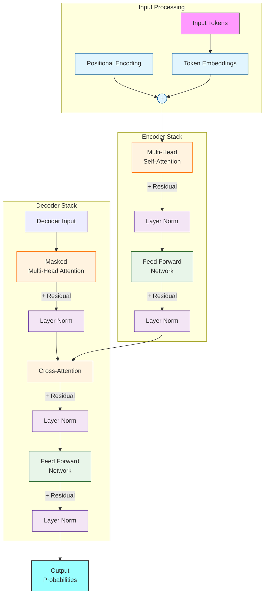

# Whats a T in GPT?

A transformer is a type of neural network architecture that's particularly well-suited for natural language processing (NLP) tasks. It was introduced in the paper "[Attention Is All You Need](https://en.wikipedia.org/wiki/Attention_Is_All_You_Need)" by Vaswani et al. in 2017.

**What's special about transformers?**

Traditional recurrent neural networks (RNNs) and long short-term memory (LSTM) networks process input sequences sequentially, one step at a time. This can be slow and inefficient for long sequences, like text documents.

Transformers, on the other hand, use a parallel architecture that allows them to process input sequences in parallel, leveraging the power of multi-head attention mechanisms. This makes them much faster and more efficient for many NLP tasks.

**Key components of a transformer:**

1. **Self-Attention Mechanism**: This is the core component of a transformer. It allows the model to attend to different parts of the input sequence simultaneously and weigh their importance.
2. **Multi-Head Attention**: This is an extension of self-attention, where the model uses multiple attention mechanisms in parallel to capture different types of relationships between input elements.
3. **Encoder-Decoder Architecture**: The transformer consists of an encoder and a decoder. The encoder takes in a sequence of tokens (e.g., words or characters) and outputs a sequence of vectors. The decoder then generates the output sequence, one token at a time, based on the output vectors from the encoder.
4. **Positional Encoding**: Since transformers don't use recurrent connections, they need a way to preserve the order of the input sequence. Positional encoding adds a fixed vector to each input element, which encodes its position in the sequence.

<mark style="background-color:purple;">**How transformers work:**</mark>

1. **Input Embedding**: The input sequence is embedded into a vector space using a learned embedding matrix.
2. **Encoder**: The embedded input sequence is fed into the encoder, which applies self-attention and multi-head attention mechanisms to generate a sequence of output vectors.
3. **Decoder**: The output vectors from the encoder are fed into the decoder, which generates the output sequence, one token at a time, using a combination of self-attention and output linear layers.
4. **Output**: The final output is generated by taking the output of the decoder and applying a softmax layer to obtain a probability distribution over the possible output tokens.

**Advantages of transformers:**

1. **Parallelization**: Transformers can be parallelized more easily than RNNs and LSTMs, making them much faster for many NLP tasks.
2. **Scalability**: Transformers can handle longer input sequences and larger models than RNNs and LSTMs.
3. **State-of-the-art performance**: Transformers have achieved state-of-the-art results in many NLP tasks, including machine translation, text classification, and question answering.

**Applications of transformers:**

1. **Machine Translation**: Transformers have been used to improve machine translation systems, achieving state-of-the-art results in many languages.
2. **Text Classification**: Transformers have been used for text classification tasks, such as sentiment analysis and spam detection.
3. **Question Answering**: Transformers have been used for question answering tasks, such as extracting answers from text passages.
4. **Language Modeling**: Transformers have been used as language models, generating coherent and natural-sounding text.

## Paper which started Transformers




