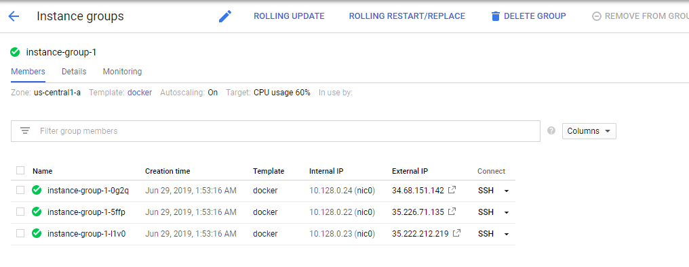
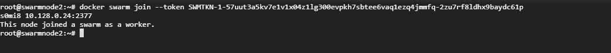
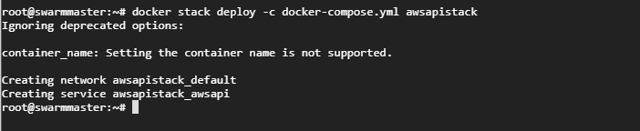
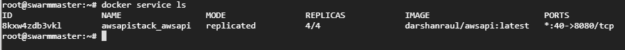
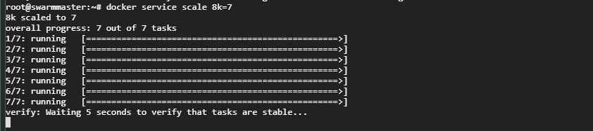
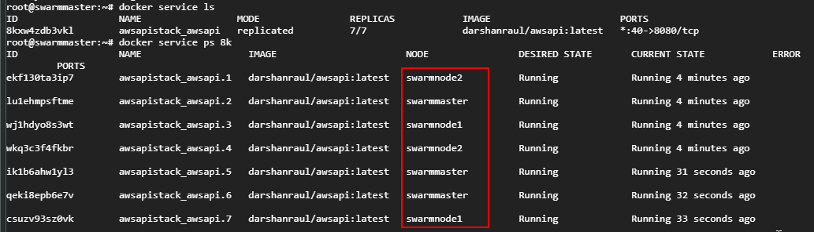
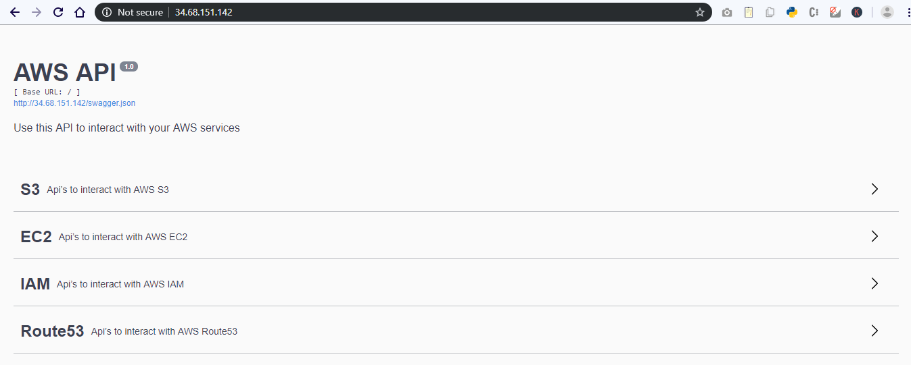
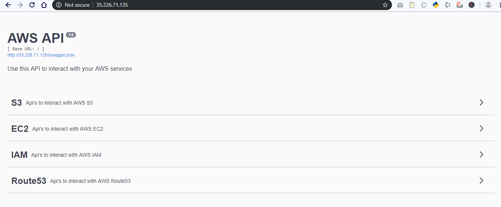

# Docker Swarm Part 1: Creating swarm from container image

I gave up on the idea of creating a container orchestrated API application because I would not prefer running the backend continuously so that the frontend web apps can get their responses. That is the reason I created a Serverless API backend.

But the container orchestration bug never left me. So heres another attempt to create a Container Orchestration  with 

1. My Container API image
2. Nginx proxy for my backend
3. Prometheus and Graphana to monitor the stack.

This will be a two part series. In first part I will just orchestrate my API container using Docker swarm. In part 2 I will expand the swarm and add monitoring services like Prometheus and Graphana.

[https://dzone.com/articles/monitoring-docker-swarm](https://dzone.com/articles/monitoring-docker-swarm)

[https://github.com/stefanprodan/swarmprom](https://github.com/stefanprodan/swarmprom)

### Docker Swarm

 A swarm is a group of machines that are running Docker and joined into a cluster. After that has happened, you continue to run the Docker commands you’re used to, but now they are executed on a cluster by a **swarm manager**. The machines in a swarm can be physical or virtual. After joining a swarm, they are referred to as **nodes**.

## Implementation:

### Create 3 instances: 1 master, 2 nodes



I created a 3 server instance group on GCP. You can use your local machine and use `docker-machine` instead.



### Creating docker-compose.yml file in master.

Before initiating the Swarm, We will first create a docker-compose file to define the services. Go to the instance you will be running as a swarm master and run `vi docker-compose.yml`


Enter this content and save the file.

```text
version: '3.0'
  
services:
  awsapi:
    image: darshanraul/awsapi:latest
    container_name: awsapi
    deploy:
      replicas: 4
    ports:
      - "80:8080"
    networks:
      - sample_network_name
networks:
  sample_network_name:
  
```

### Initializing the Swarm 

On the instance you intend to be the swarm master, run `docker swarm init`


You should be seeing an output similar to  `docker swarm join --token <token>`

Copy this and continue to the next step. Your current node is the Swarm master now.

### Join the worker nodes

Go to the other 2 instances and paste the   `docker swarm join --token <token>` 

Your instances will now become the worker nodes in the swarm.




### Deploying the stack on the swarm

Now our swarm is ready. You can check the master and worker node status using `docker node ls`


The \* in front of the Id field represents the swarm node you are on.

Now lets deploy the stack. On the swarm master go to the folder where you created the docker compose file. Run  `docker stack deploy -c docker-compose.yml <stack_name>`



Here are all the docker service commands:

```text
Usage:  docker service COMMAND

Manage services

Commands:
  create      Create a new service
  inspect     Display detailed information on one or more services
  logs        Fetch the logs of a service or task
  ls          List services
  ps          List the tasks of one or more services
  rm          Remove one or more services
  rollback    Revert changes to a service's configuration
  scale       Scale one or multiple replicated services
  update      Update a service
```

List all the services created. In this case just one. You should be seeing that there are 4 replicas created. Lets see in which nodes they are created.



Run `docker service ps <service_id>`


You will be seeing all the running tasks of the service. **tasks** are nothing but containers running the service. In the NODE field. You will see that the tasks are running on different nodes of the Swarm. Mission Accomplished !

### Scaling the Swarm

Now suppose you need to scale up the stack and run more tasks for a service. You simple use \` `docker service scale "stack_id"="no of tasks"`



In this case I scaled it to 7. You will see the progress as the service is scaled.



You can verify by running `docker service ps <service_id>` that there are 7 tasks running now.

### Accesing the service

As the service tasks are running on multiple nodes. The exposed port 8080 is mapped to 80 on the external host. You can easily just go to the instance Ip address and check if the API is working.

1. Working on the Master instance IP



2. Working on the Node instance IP



Thats it for part 1. In part 2 I will be adding more services and also monitoring the stack.

