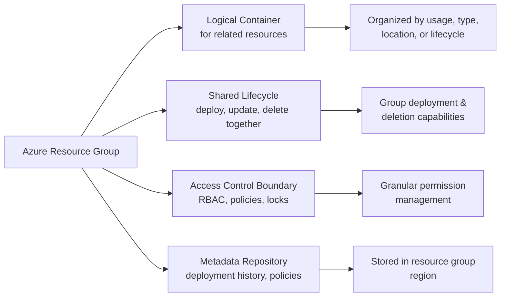
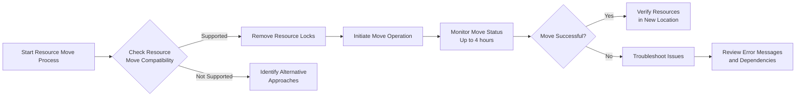
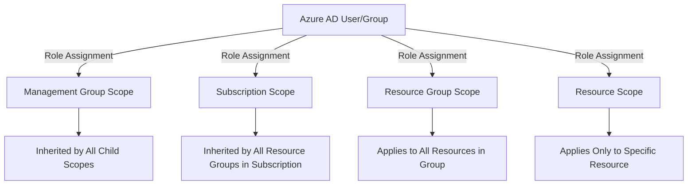

# Resource Group

### 🔍 1 Understanding Azure Resource Groups

#### 1.1 What Are Resource Groups?

Azure **Resource Groups** are fundamental logical containers that serve as the organizational backbone for managing Azure resources. They function as a unified collection of related resources that share the same lifecycle, deployment updates, and deletion processes within Azure's deployment and management service - **Azure Resource Manager (ARM)**. Every Azure resource must be placed in exactly one resource group, and this containerization provides the essential structure for efficient cloud resource management.

#### 1.2 Key Characteristics of Resource Groups

* **Logical Grouping**: Resource Groups organize resources based on usage, type, location, or other meaningful criteria for your organization. They don't necessarily need to contain all resources for a solution, but rather those that should be managed together.
* **Lifecycle Management**: Resources within a resource group share the same deployment, update, and deletion lifecycle. When you delete a resource group, all resources within it are automatically deleted, which provides a powerful mechanism for managing complete application environments&#x20;
* **Access Control Scope**: Resource Groups serve as a boundary for applying **Role-Based Access Control (RBAC)** permissions, policies, and locks. You can grant teams or individuals specific permissions at the resource group level rather than managing access for each individual resource&#x20;
* **Metadata Storage**: Resource Groups store metadata about the resources they contain, including deployment history, policy assignments, and diagnostic settings. This metadata is stored in the region where the resource group is created.



### 🏗️ 2 Resource Group Organizational Strategies

#### 2.1 Common Grouping Approaches

Organizing Azure resources effectively requires thoughtful consideration of your application architecture, organizational structure, and operational requirements. Here are the most common strategies:

| **Strategy**       | **Description**                                          | **Best For**                                        | **Example**                                                |
| ------------------ | -------------------------------------------------------- | --------------------------------------------------- | ---------------------------------------------------------- |
| **By Application** | Groups all resources for a specific application together | Small to medium applications, test/dev environments | `e-commerce-prod-rg` containing web app, database, storage |
| **By Function**    | Groups similar resource types across applications        | Large environments, specialized teams               | `network-infra-rg` containing VNETs, NSGs, Load Balancers  |
| **By Environment** | Groups resources based on deployment environment         | Environments with clear lifecycle separation        | `prod-rg`, `dev-rg`, `test-rg`                             |
| **By Department**  | Groups resources based on organizational ownership       | Large enterprises with cost centers                 | `marketing-rg`, `finance-rg`, `hr-rg`                      |
| **By Cost Center** | Groups resources based on billing allocations            | Organizations with chargeback requirements          | `project-x-rg`, `shared-services-rg`                       |

#### 2.2 Hybrid Organizational Models

Many organizations adopt hybrid approaches that combine multiple strategies. For example:

* **Application-based with functional subgroups**: Main application resource group with separate groups for shared networking infrastructure
* **Environment-based with departmental divisions**: Separate production, development, and testing groups, each with departmental sub-groups
* **Cost center-based with environment tagging**: Resources grouped by cost center but tagged with environment information for filtering

> 💡 **Key Consideration**: The optimal strategy depends on your organization's structure, operational requirements, and governance needs. Consider factors like team responsibilities, resource lifecycles, and compliance requirements when designing your resource group structure .

### ⚙️ 3 Resource Group Management Operations

#### 3.1 Creating and Configuring Resource Groups

Resource Groups can be created and managed through multiple interfaces:

* **Azure Portal**: Navigate to "Resource Groups" → "Create" → specify name, region, and subscription
* **Azure PowerShell**: `New-AzResourceGroup -Name "myResourceGroup" -Location "EastUS"`
* **Azure CLI**: `az group create --name myResourceGroup --location eastus`
* **ARM Templates/Bicep**: Define resource groups at subscription or management group scope
* **REST API**: Use the resource provider endpoint for programmatic access

When creating resource groups, consider these important factors:

* **Region Selection**: **While resources can be in different regions, the resource group itself must be created in a specific region where its metadata is stored**. If this region becomes unavailable, you cannot update resources in the group until it's restored.
* **Naming Conventions**: Use consistent, descriptive naming that follows Azure's naming requirements:
  * 3-64 characters
  * Alphanumeric, underscores, periods, and hyphens
  * Must start with letter or number
  * Must end with letter, number, or underscore
  * Case-insensitive&#x20;

#### 3.2 Deploying Resources to Resource Groups

Resources are typically deployed using ARM templates or Bicep files with resource group-scoped deployments:

```powershell
# Azure PowerShell example
New-AzResourceGroupDeployment `
  -ResourceGroupName "myResourceGroup" `
  -TemplateFile "main.bicep" `
  -storageAccountType "Standard_GRS"
```

```azurecli
# Azure CLI example
az deployment group create \
  --resource-group myResourceGroup \
  --template-file main.bicep \
  --parameters storageAccountType=Standard_GRS
```

<details>

<summary>📋 ARM Template Deployment Modes</summary>

ARM templates support two deployment modes:

* **Incremental Mode** (default): Resources are added to the resource group. Existing resources are left unchanged.
* **Complete Mode**: Resources in the resource group that are not in the template are deleted. This requires careful planning to avoid unintended data loss.

</details>

#### 3.3 Moving Resources Between Resource Groups

**Azure provides the capability to move resources between resource groups and even across subscriptions, but with several important restrictions and considerations**:

* **Prerequisites**: The account moving resources must have:
  * `Microsoft.Resources/subscriptions/resourceGroups/moveResources/action` on the source resource group
  * `Microsoft.Resources/subscriptions/resourceGroups/write` on the target resource group&#x20;
* **Limitations**:
  * <mark style="background-color:red;">Not all resource types support movement</mark>
  * Resources must be moved together with their dependencies
  * Some Azure services have specific move requirements or limitations
  * <mark style="color:red;">Resource locks must be removed before moving</mark>
  * Moving resources can cause temporary service disruption 【turn0search16】【turn0search18】
* **Process**:
  1. Verify that all resources support movement
  2. Remove any resource locks
  3. Use Azure Portal, PowerShell, CLI, or REST API to initiate move
  4. Monitor the operation (may take up to 4 hours) 【turn0search17】【turn0search18】



#### 3.4 Resource Locking

Resource locks provide an additional protection layer for critical resources to prevent accidental deletion or modification:

* **CanNotDelete Lock**: Prevents resource deletion but allows modification
* **ReadOnly Lock**: Prevents all modifications but allows read operations

> ⚠️ **Important**: Resource locks are applied to all users, including those with Owner permissions. Only users with the appropriate permissions (typically Owner and User Access Administrator roles) can manage locks

### 🔐 4 Access Control with Resource Groups

#### 4.1 Role-Based Access Control (RBAC) Implementation

Resource Groups are the primary scope for implementing Azure RBAC, which provides fine-grained access management:

* **Built-in Roles**: Azure provides numerous built-in roles with predefined permissions:
  * Owner: Full access to all resources
  * Contributor: Full access except granting permissions to others
  * Reader: View-only access
  * User Access Administrator: Manage user access to Azure resources
*   **Custom Roles**: Create roles with specific permissions tailored to organizational needs:

    ```json
    {
      "Name": "Virtual Machine Operator",
      "Description": "Can monitor and restart virtual machines",
      "Actions": [
        "Microsoft.Compute/*/read",
        "Microsoft.Compute/virtualMachines/start/action",
        "Microsoft.Compute/virtualMachines/restart/action"
      ],
      "AssignableScopes": [
        "/subscriptions/{subscriptionId}",
        "/providers/Microsoft.Management/managementGroups/{groupId}"
      ]
    }
    ```

#### 4.2 RBAC Assignment Best Practices

When assigning roles at the resource group level, consider these guidelines:

* **Least Privilege Principle**: Grant only the minimum permissions necessary for users to perform their tasks
* **Group-Based Assignments**: Assign roles to Azure AD groups rather than individual users for easier management
* **Inheritance Understanding**: Roles assigned at higher scopes (subscription, management group) are inherited by resource groups and resources
* **Separation of Duties**: Implement role separation to prevent any single user from having excessive permissions



### 🏷️ 5 Tagging and Metadata Management

#### 5.1 Tagging Strategy Implementation

Tags are key-value pairs that provide metadata for organizing and identifying Azure resources, resource groups, and subscriptions:

* **Business Value**: Tags enable cost allocation, resource organization, automation, and operational efficiency
* **Recommended Tag Keys**: Environment (Production, Development), Cost Center, Owner, Application Name, Compliance Requirements
* **Tag Inheritance**: Resources do not automatically inherit tags from their resource groups, though you can implement policies to enforce this 【turn0search26】【turn0search47】

<details>

<summary>🔧 Azure Policy for Tag Inheritance</summary>

You can use Azure Policy to enforce tag inheritance from resource groups to resources:

```json
{
  "mode": "Indexed",
  "policyRule": {
    "if": {
      "field": "type",
      "in": ["Microsoft.Resources/subscriptions/resourceGroups"]
    },
    "then": {
      "effect": "modify",
      "details": {
        "roleDefinitionIds": [
          "/providers/microsoft.authorization/roleDefinitions/b24988ac-6180-42a0-ab88-20f7382dd24c"
        ],
        "operations": [
          {
            "operation": "addOrReplace",
            "field": "tags['Environment']",
            "value": "[field('tags['Environment']')]"
          }
        ]
      }
    }
  },
  "parameters": {}
}
```

</details>

#### 5.2 Tag Limitations and Considerations

* **Quantity Limits**: Each resource can have up to 50 tags 【turn0search11】【turn0search62】
* **Case Sensitivity**: Tag keys are case-insensitive, but values are case-sensitive 【turn0search47】
* **Storage**: Tags are stored as plain text, so avoid including sensitive information 【turn0search47】
* **Non-English Characters**: Using non-English characters in tags may cause decoding issues in some scenarios 【turn0search47】

### ⚠️ 6 Common Gotchas and Limitations

#### 6.1 Resource Group Constraints

* **Deletion Irreversibility**: Deleting a resource group permanently removes all resources within it. This action cannot be undone 【turn0search42】【turn0search44】.
* **Non-Nestable Structure**: Resource groups cannot contain other resource groups. All resources must be at the top level within a resource group 【turn0search25】【turn0search49】.
* **Regional Metadata Storage**: The metadata for resources in a resource group is stored in the resource group's region. If this region becomes unavailable, you cannot update resources in the group until the region is restored, even if the actual resources are in other regions 【turn0search8】【turn0search51】.
* **No Renaming**: Resource groups cannot be renamed after creation. You must create a new resource group with the desired name and move the resources 【turn0search25】.

#### 6.2 Deployment and Management Pitfalls

* **Deployment History Limitations**: Each resource group retains a deployment history with a maximum of 800 deployments. When this limit is reached, older deployments are automatically removed from history, but the deployed resources remain unaffected 【turn0search11】【move0search62】.
* **Template Size Restrictions**: ARM templates are limited to 4 MB in size, with individual resource definitions limited to 1 MB. These limits apply to the final state of the template after expansion with iterative definitions, variables, and parameters 【turn0search8】【turn0search51】.
* **Move Operation Complexity**: Moving resources between subscriptions or resource groups can be complex and time-consuming (potentially up to 4 hours). The operation locks both source and destination resource groups during this period 【turn0search18】.
* **Resource Provider Registration**: Some resources require specific resource providers to be registered before deployment. Attempting to deploy without registering these providers will result in authorization errors 【turn0search64】.

#### 6.3 Access and Security Considerations

* **RBAC vs. Locks Confusion**: Role-based access control (RBAC) and resource locks serve different purposes and operate independently. RBAC manages user permissions, while locks prevent accidental modifications regardless of user permissions 【turn0search45】.
* **Managed Identity Cleanup**: Deleting a user-assigned managed identity does not automatically remove its references from resources that were using it. These must be cleaned up separately to avoid orphaned references 【turn0search41】【turn0search43】.
* **Diagnostic Settings**: Diagnostic settings at the resource group level apply to all resources within the group that support diagnostics. This can be beneficial but may also result in excessive data collection if not carefully managed.

#### 6.4 Troubleshooting Common Issues

| **Issue**                                                                 | **Potential Cause**                                 | **Resolution**                                                                                 |
| ------------------------------------------------------------------------- | --------------------------------------------------- | ---------------------------------------------------------------------------------------------- |
| Deployment fails with `AuthorizationFailed`                               | Insufficient permissions                            | Verify RBAC assignments and resource provider registration                                     |
| Resource move operation fails with `ResourceMoveProviderValidationFailed` | Resource type not supported or dependencies not met | Check resource move capabilities and ensure all dependencies are moved together                |
| Cannot access resources in resource group                                 | Region unavailable for resource group metadata      | Wait for region restoration or consider moving resources to a new group in an available region |
| Deployment quota exceeded                                                 | Too many concurrent deployments                     | Reduce concurrent operations or clean up deployment history                                    |

### 🎯 7 Best Practices and Recommendations

#### 7.1 Resource Group Design Principles

* **Lifecycle Alignment**: Group resources with similar lifecycles together to facilitate coordinated deployment, updates, and deletion 【turn0search49】【turn0search69】.
* **Team Ownership**: Organize resources based on which teams own and manage them to simplify access control and operational responsibilities 【turn0search69】.
* **Consistent Naming**: Implement and enforce naming conventions across resource groups to improve discoverability and management efficiency.
* **Documentation**: Maintain clear documentation of your resource group structure, including the rationale for groupings and ownership responsibilities.

#### 7.2 Operational Excellence

* **Automation**: Use Infrastructure as Code (IaC) with tools like Bicep, Terraform, or ARM templates for all resource group deployments to ensure consistency and repeatability 【turn0search68】.
* **Monitoring and Alerting**: Implement monitoring at the resource group level to track health, performance, and cost metrics across related resources.
* **Regular Audits**: Periodically review resource group membership to ensure resources are still appropriately grouped and that access permissions remain valid.
* **Cost Management**: Implement tagging strategies at the resource group level to enable accurate cost allocation and optimization.

#### 7.3 Security Considerations

* **Just-In-Time Access**: Implement just-in-time access requests for sensitive operations on resource groups rather than granting standing permissions.
* **Least Privilege**: Apply the principle of least privilege when assigning roles at the resource group level, using custom roles when built-in roles are too permissive.
* **Resource Locking**: Apply resource locks to critical resource groups to prevent accidental deletion or modification by authorized users.
* **Policy Enforcement**: Use Azure Policy to enforce governance requirements across resource groups, such as requiring specific tags or preventing certain resource types.

### 📚 8 Conclusion and Next Steps

Azure Resource Groups are fundamental to effective cloud resource management, providing the organizational framework that enables efficient deployment, access control, and operational management of cloud resources. By understanding their characteristics, implementing effective organizational strategies, and avoiding common pitfalls, organizations can significantly improve their cloud governance and operational efficiency.

#### Recommended Next Steps

1. **Audit Existing Resource Groups**: Review your current resource group structure against best practices and organizational requirements.
2. **Develop Naming Conventions**: Establish and document naming conventions for resource groups across your organization.
3. **Implement Tagging Strategy**: Develop and implement a comprehensive tagging strategy for resource organization and cost management.
4. **Create Resource Group Templates**: Develop templates for common resource group structures to ensure consistency across deployments.
5. **Train Teams**: Ensure your teams understand resource group concepts, access control, and operational procedures.

By following these guidelines and continuously refining your approach based on operational experience, you can leverage Azure Resource Groups to build a well-organized, manageable, and secure cloud environment that supports your organization's objectives.
