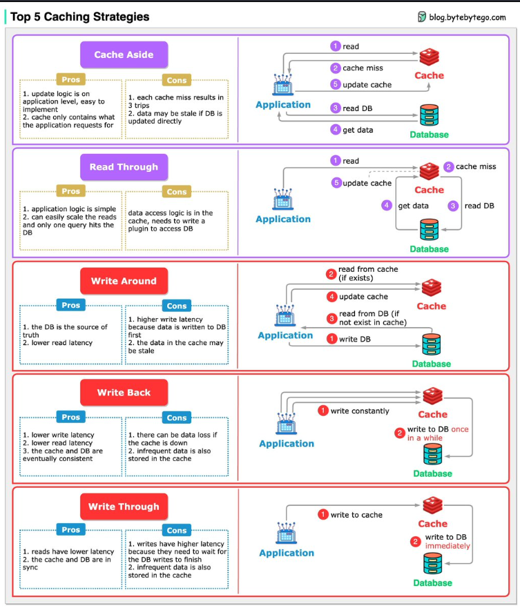

# DevSecOps

DevSecOps (development security operations) is an organizational model that aims to establish a continuous integration and delivery cycle that combines application development with security and operations considerations

DevSecOps differs from DevOps in that it extends the DevOps philosophy to incorporate security objectives.

DevSecOps should not be considered a separate concept from DevOps, but rather a natural continuation of it.

<figure><figcaption></figcaption></figure>

## Video:


A very comprehensive video which covers every aspect of devsecops




DevSecOps introduces security activities early in the SDLC, rather than waiting until the product is released. Security issues can be identified and resolved during the application development process, with development teams performing security tasks independently.

This approach helps prevent security vulnerabilities from reaching production, which reduces the cost of fixing flaws after release. A collaborative culture helps align security with DevOps efforts and enables scalability. With DevSecOps, automated security measures are built into every stage of the development pipeline.

**The principles of using Continuous Security are:**

1. Prevent committing secrets to source code repositories so that bad actors do not have keys to access AWS resources.
2. Prevent common developer mistakes that make web applications vulnerable (static and runtime).
3. Ensure there are backups for compromised resources so that bad actors do not have as much to gain from blocking access to the resources.&#x20;
4. Encrypt all relevant data so that if a bad actor gains access to data, they have much less to gain through extortion.
5. Detect when unauthorized users access resources so that mitigations can take place.&#x20;
6. Ensure access keys are short lived  so there is limited access duration to compromised resources.
7. Ensure permissions use least privilege to prevent really bad things from happening if a bad actor gains access to the keys.
8. Prevent or detect misconfiguration that make resources vulnerable.


**analysis tools and technologies include:**

* **Static application security testing (SAST)**—analyzes source code to identify code quality issues, non-secure coding practices, and known vulnerabilities.&#x20;
* **Software composition analysis (SCA)**—examines third-party and open source packages, including their dependencies that are resolved during a build, to identify known vulnerabilities and potential open source license conflicts.&#x20;
* **Dynamic application security testing (DAST)**—analyzes running applications to detect vulnerabilities that manifest at runtime, as well as other potential attack vectors.
* **Interactive application security testing (IAST)**—is a middle ground between SAST and DAST, which uses source-level knowledge of the application structure to detect vulnerable conditions and attack vectors in compiled applications.
* **Threat modeling—**&#x65;nables prediction, detection, and analysis of security threats by identifying the attack surface. This enables teams to proactively minimize exposure to the identified risks.


**IAM methods include:**

* **Authentication controls**—these verify the identity of a user or application.&#x20;
* **Authorization controls**—these grant authorized users access to a specific resource or function.
* **Role-based access controls (RBACs)**—provide a group of users access to a resource or function based on their responsibilities or collective permissions. This simplifies administration and onboarding and helps reduce privilege creep.&#x20;
* **Hardware security modules (HSMs)**—these are physical devices that help manage and protect secrets such as credentials, certificates, and keys, both at rest and in transit.
* **Identity providers (IdPs)—**&#x74;hese are services that manage user authorization.
* **Secrets vaults—**&#x74;hese store secrets and ensure that only authorized users can access them.
* **Container image provenance and image signing**—these functions validate the authenticity of container images and establish trust.

```
```



<figure><figcaption></figcaption></figure>






