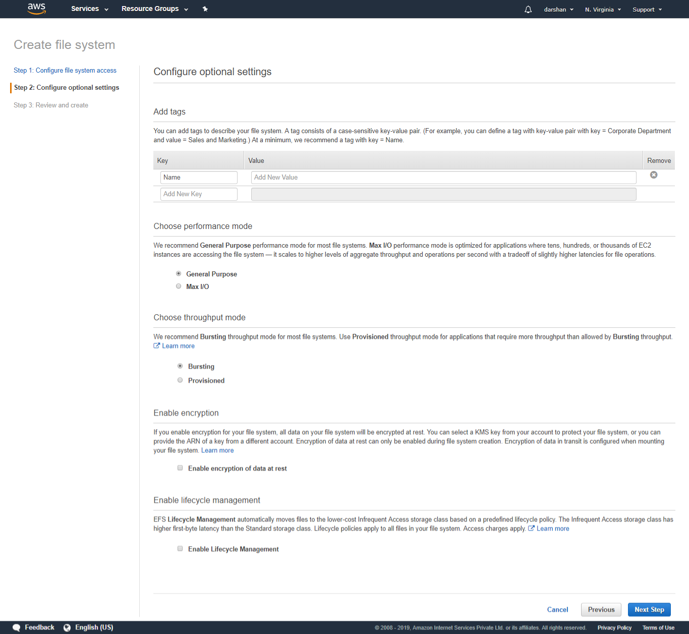

# EFS

Go to the EFS console home page:

An Amazon EFS file system is accessed by EC2 instances running inside one of your VPCs. Instances connect to a file system by using a network interface called a mount target. Each mount target has an IP address, which we assign automatically or you can specify.

1. Provide the VPC for the mount target
2. Create a mount target in the available subnet's. I have one created.

on the next page:

1. Add Tags
2. **Choose performance mode: General Mode or High IO**
3. **Choose throughput mode: Bursting or Provisioned**
4. Enable Encryption : all data on your file system will be encrypted at rest.\
5. **Enable lifecycle management:**automatically moves files to the lower-cost Infrequent Access storage class based on a predefined lifecycle policy.

Next will be the review page and click 'Create' 

The following Success page will be visible .

Mount target will be in Creating state.

Click this link for the instructions to attach it to EC2 instance.

Time to create a EC2 instance and connect it to the EFS mount target.

Followed the standard procedure to connect to the server and SSH to it.

