# Static Website

So one of the best usecase for using S3 for hosting a static website is the huge cost savings due to it. I have direct experience of that after hosting a website for an NGO for over an year on S3. Normal bootstrap html, css, js files, No fancy single web page framework etc \(Though I have tried that too using gatsby js \(React Static website framework\)\).

But I wanted to take that a level up and use CDN and DNS server attached to it. Enter Route53 and AWS Cloudfront.

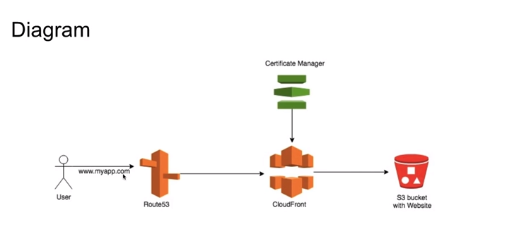

Steps:


Go to Route53 and create a hosted zone

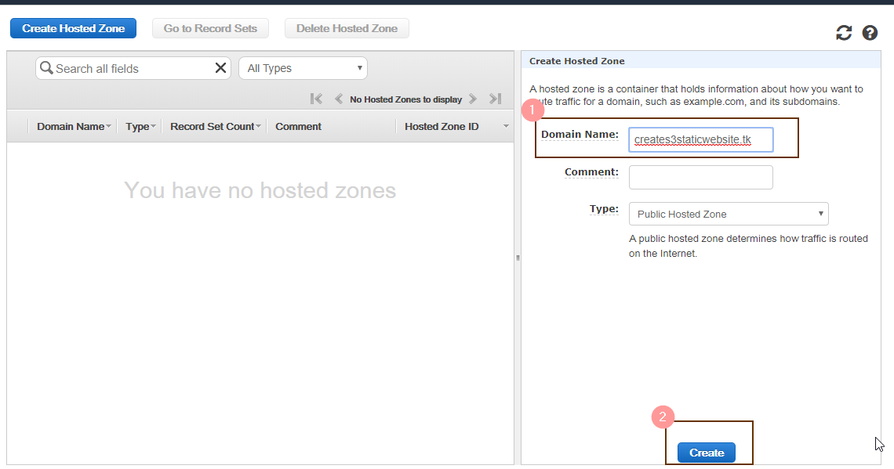

In the Domain name section ,Enter the Domain Name you purchased from the Domain Registrar. Here I used a free domain .tk here but you can use any domain registrar eg GoDaddy etc.

You can also use AWS Route53 to buy a domain name. [https://docs.aws.amazon.com/Route53/latest/DeveloperGuide/registrar.html](https://docs.aws.amazon.com/Route53/latest/DeveloperGuide/registrar.html)

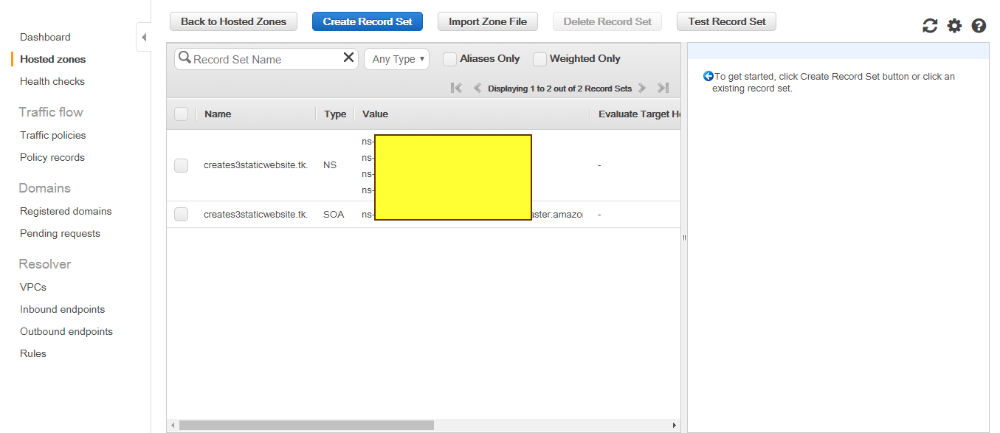

Once done this will be the default record sets of the hosted zones.

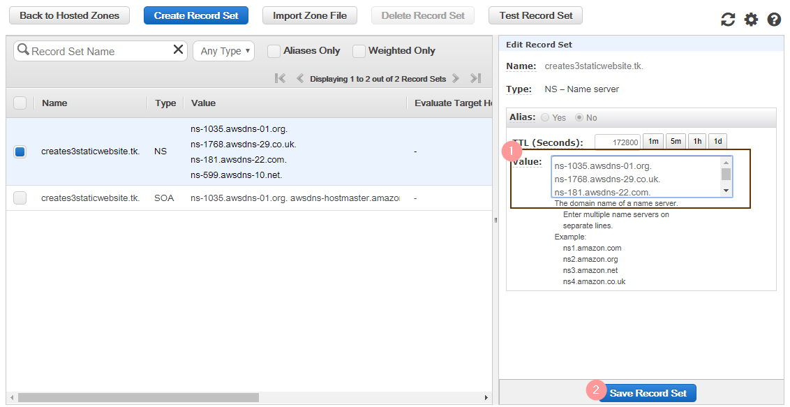

In the NS \(Name server records\), Copy this name servers and replace your domain registrars name servers with this. Keep them the same if you used AWS for buying the domain.

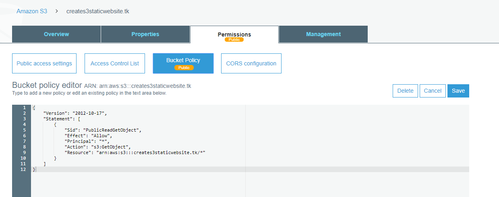

On S3 end, Create a bucket of the same name as the domain name\(MANDATORY\) , Copy the website files in the bucket and in the Bucket policy , insert this policy

```text
{
    "Version": "2012-10-17",
    "Statement": [
        {
            "Sid": "PublicReadGetObject",
            "Effect": "Allow",
            "Principal": "*",
            "Action": [
                "s3:GetObject"
            ],
            "Resource": [
                "arn:aws:s3:::example-bucket/*"
            ]
        }
    ]
}

```

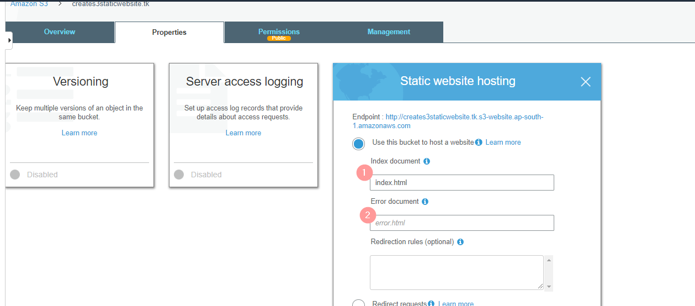

Next in the Properties section , Enable static website hosting and give the respective index and error page html file names.

Note Down the Endpoint url as you will be using it on the Cloudfront end.

That's all you need to don on the S3 side.

Lets look at CDN end of this ie AWS Cloudfront.

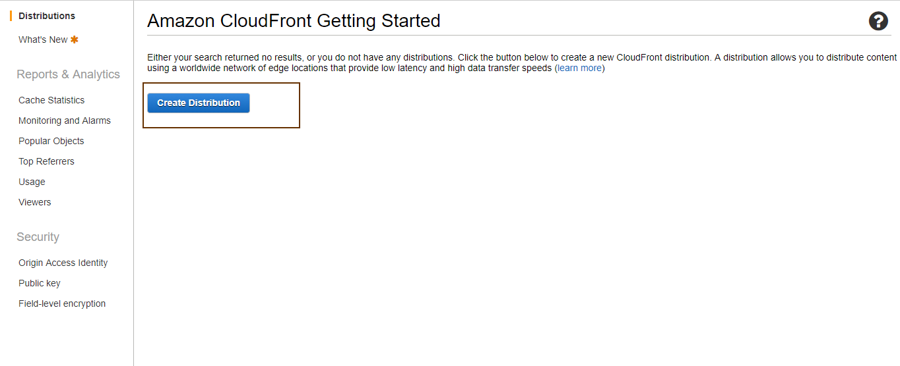

Create a distribution from the console home page.

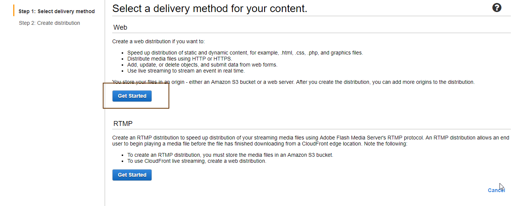

Select Web Distribution.

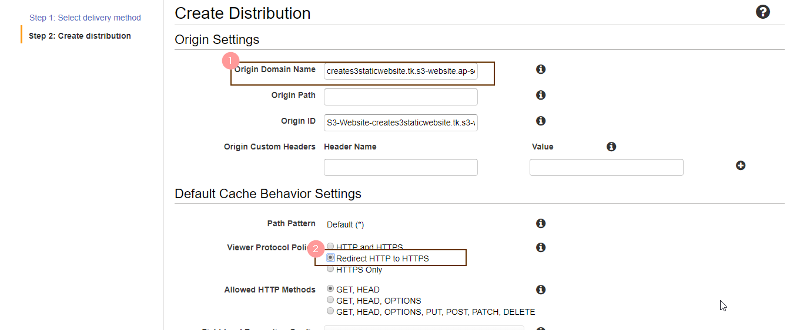

in the Origin Domain name give the S3 static website domain name from the S3 console. In the Protocol policy section select 'Redirect HTTP to HTTPS' section.

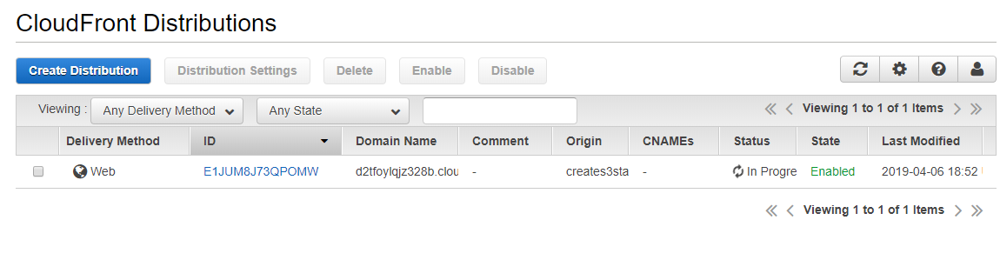

The Distribution will be created.

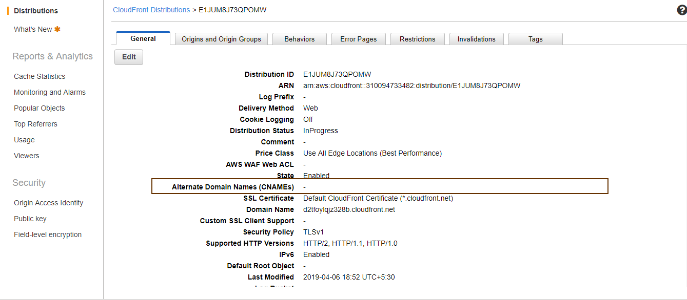

In the general properties section, Change the CNAME \(Alternate domain name\) to the Domain name \(in this case 'creates3staticwebsite.tk'\)

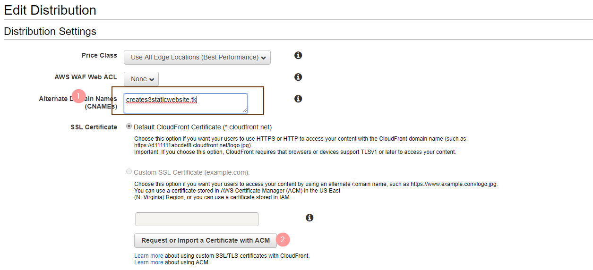

That is it from the Cloudfront end. 

Lets look at AWS Certificate manager to create a SSL certificate.

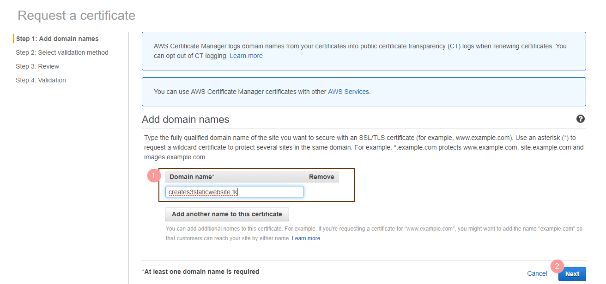

In the console insert the domain name in the add domain names section.

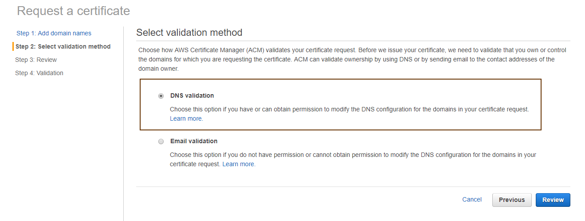

Select the DNS validation option

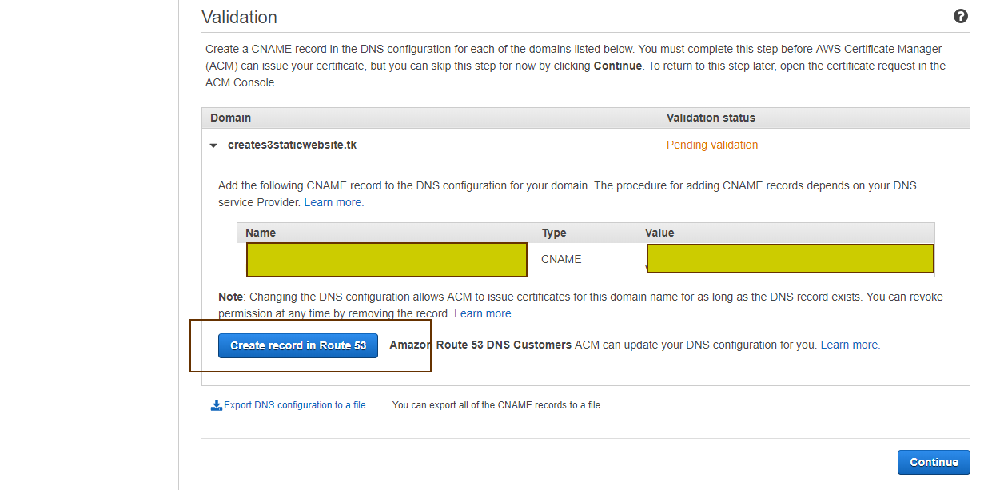

The SSL certificate will be created. Now you can either manually enter a record for this in Route53 or in your own DNS server. 

But in my case I wanted to use it in Route53 ,So i used the inbuilt button to automatically add the record in route53.

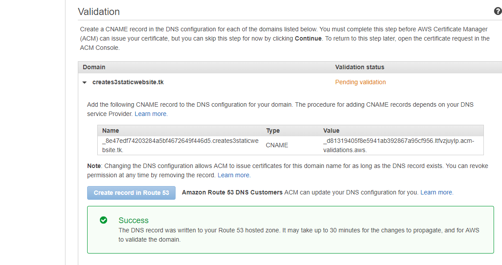

Once done , you will see the Success message. But it will take around 5-10 mins for the validation to complete.

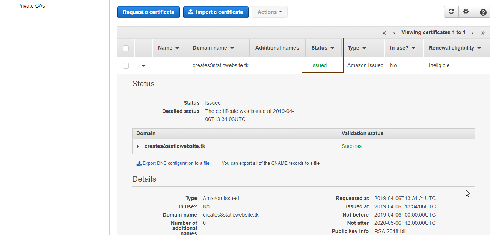

After the validation is complete you should be able to see the status as 'Issued'

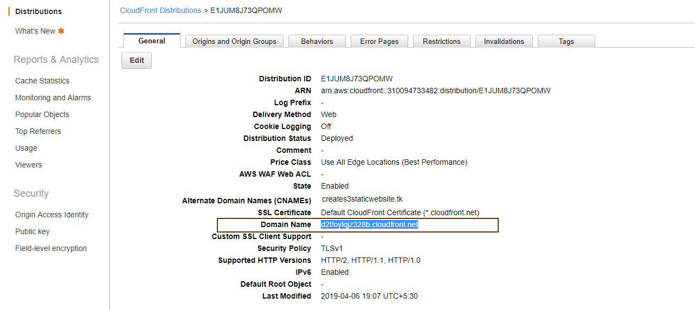

Copy this domain name from the Cloudfront console.


and in the Route53 console,  create a record set and choose type A

Choose Alias option as yes and choose the target as the cgn endpoint.

Thats it. Give it some 10-15 minutes and then &gt;&gt;&gt; https://creates3staticwebsite.tk is live!


