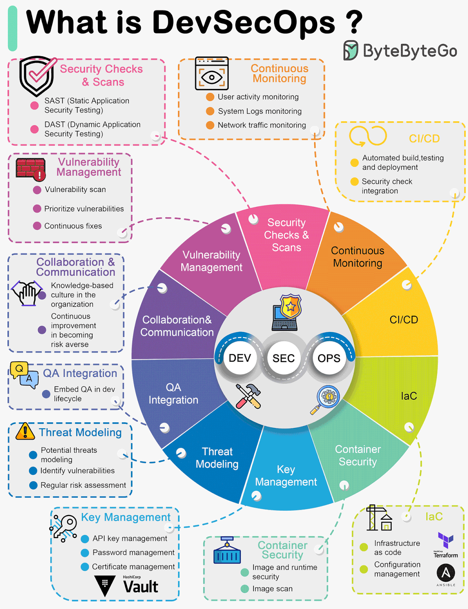

# The hard way

Then best way to be crystal clear about all of the internal components of k8s is to go through this excellent repo on github, its a derivative of the infamous k8s the hard way by kelsey hightower, but this one is much harder. Tests you but is very comprehensive and you will learn a lot



You start by creating 7 vms using QEMU \[note to enable nested virtualization if working on a cloud vm]

<figure><figcaption></figcaption></figure>

<figure><figcaption></figcaption></figure>
