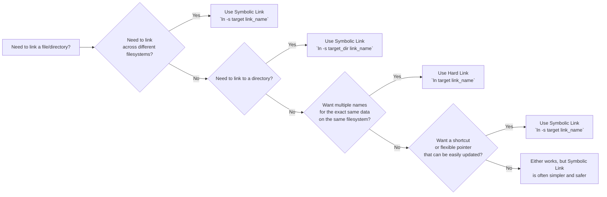

# hardlink vs softlink

Choosing between hard links and soft (symbolic) links in Linux is about understanding how they work, their strengths, weaknesses, and ideal use cases. The search results provide excellent foundational information, which I'll expand upon with practical examples and a decision-making framework.

#### 📊 Hard Link vs. Symbolic Link: Quick Comparison

Here's a high-level comparison to orient you:

| Feature                                | Hard Link                                                                                                        | Symbolic (Soft) Link                                                                                             |
| -------------------------------------- | ---------------------------------------------------------------------------------------------------------------- | ---------------------------------------------------------------------------------------------------------------- |
| **Underlying Mechanism**               | Direct reference to the same **inode** (data block) on the filesystem【turn0search5】【turn0search9】                | A separate file containing the **path** to the target file or directory【turn0search14】                           |
| **Cross Filesystem**                   | ❌ **No** - Must be on the same filesystem【turn0search2】                                                          | ✅ **Yes** - Can point to files/directories on different filesystems【turn0search2】                                |
| **Link to Directories**                | ❌ **No** (Superuser can technically create them, but it's complex and often discouraged)                         | ✅ **Yes** - Can link to directories【turn0search2】                                                                |
| **What Happens if Target is Deleted?** | ✅ **Link remains valid** - Data is still accessible through other hard links until all are removed【turn0search2】 | ❌ **Link becomes broken** ("dangling symlink") - Points to a non-existent location【turn0search10】【turn0search12】 |
| **Permissions**                        | All hard links to the same file **share identical permissions** (stored in the inode)【turn0search2】              | Can have **different permissions** from the target file (though uncommon)【turn0search2】                          |
| **Creation Command**                   | `ln target link_name`                                                                                            | `ln -s target link_name`                                                                                         |
| **Metadata (`ls -l`)**                 | Shows the number of hard links (e.g., `2`)                                                                       | Shows an `l` in the first column and points to the target (e.g., `link -> target`)                               |
| **Typical Use Case**                   | Creating "aliases" for a file, atomic backups, ensuring data availability across locations                       | Creating shortcuts, linking to libraries, managing configuration files, versioning software                      |

***

#### 🔍 Deep Dive: Understanding How They Work

The key difference lies in what the link actually points to, which is best explained through the concept of the **inode**.

* **The Inode:** Every file on a Linux filesystem has a unique inode number. This inode stores the file's **metadata** (permissions, owner, size, timestamps) and **pointers to the actual data blocks** on the disk. The **filename** you see is just a label in a directory that points to this inode.
*   **Hard Link:** A hard link creates a **new directory entry that points directly to the same inode as the original file**. From the filesystem's perspective, there is no "original" file—all directory entries are equal. Think of it as giving a file multiple names in the same room.

    ```bash
    # Create a file and two hard links to it
    echo "Hello, World!" > original.txt
    ln original.txt hardlink1.txt
    ln original.txt hardlink2.txt

    # All three names point to the same inode. Check it with ls -i
    ls -i *.txt
    # Output might look like (inode numbers will vary):
    # 123456 original.txt  hardlink1.txt  hardlink2.txt
    # All have the SAME inode number (123456)

    # Deleting one name doesn't affect the data or other links
    rm original.txt
    cat hardlink1.txt # Still prints "Hello, World!"
    cat hardlink2.txt # Also prints "Hello, World!"
    ```
*   **Symbolic (Soft) Link:** A symbolic link is a **small, special file that contains the path to another file or directory**. It's essentially a shortcut. The symlink has its **own inode** pointing to its own data block, which stores the target's path string.

    ```bash
    # Create a file and a symbolic link to it
    echo "Hello, Symlink!" > target.txt
    ln -s target.txt symlink.txt

    # The symlink has its own inode and points to the target's path
    ls -li *.txt
    # Output might look like:
    # 234567 -rw-r--r-- 1 user group 15 Jan 12 10:00 target.txt
    # 345678 lrwxrwxrwx 1 user group  9 Jan 12 10:00 symlink.txt -> target.txt
    # Note the different inode numbers and the 'l' for symlink

    # If the target is moved or deleted, the symlink becomes broken
    mv target.txt new_target.txt
    cat symlink.txt # Output: cat: symlink.txt: No such file or directory
    ```

<details>

<summary><strong>🛠️ Advanced: Finding and Managing Broken Symlinks</strong></summary>

A common task is finding broken (dangling) symlinks. You can use the `find` command:

```bash
# Find all broken symlinks in the current directory and its subdirectories
find . -type l ! -exec test -e {} \; -print
```

A more readable version uses `-lname`:

```bash
# Another way to find broken symlinks
find . -xtype l
```

To remove them, you can combine `find` with `rm`:

```bash
# CAUTION: This command will delete files. Use the -print option first to verify.
find . -xtype l -delete
```

There are also utilities like `symlinks` (often in a package of the same name) that can audit and report on dangling links more comprehensively【turn0search11】.

</details>

***

#### 🎯 When to Use Which: A Practical Guide

The decision tree and examples below will help you choose the right tool for the job.

**Hard Links: Use Cases and Why**

Choose hard links when you need **multiple, equivalent names for the exact same data** within the same filesystem.

1. **Atomic Backups and Snapshots**
   * **Scenario:** You want to create a backup of a file but also want the backup to be instantly usable and not take up additional space.
   * **How:** Create a hard link to the file before you make changes. If you mess up, you can restore from the hard link.
   * **Why:** The hard link points to the same data blocks. It's instant and uses zero additional disk space until you start modifying the original file (Copy-on-Write).
2. **Managing Software Versions**
   * **Scenario:** You have `program_v1.0` and `program_v2.0`. You want a `program` link that always points to the latest stable version.
   * **How:** You could use a symlink, but a hard link ensures that if you ever accidentally delete the `program_v2.0` file, `program` still works (as long as at least one hard link exists).
   * **Why:** It provides a level of redundancy against accidental deletion of a specific version file.
3. **Ensuring Data Availability Across Directories**
   * **Scenario:** A large log file needs to be accessed from two different directories for different scripts.
   * **How:** Create a hard link to the log file in the second directory instead of copying it.
   * **Why:** Any write to the file through one link is instantly visible through the other. No synchronization needed, no wasted disk space.

**Symbolic Links: Use Cases and Why**

Choose symbolic links for their **flexibility, ability to cross filesystems, and link to directories**. They are the more common and versatile choice.

1. **Creating Shortcuts and Organizing Files**
   * **Scenario:** You want a quick access link to a deeply nested directory or file on your desktop or in your home directory.
   * **How:** `ln -s /very/long/path/to/important/file ~/important-file`
   * **Why:** Symlinks act as perfect shortcuts. They can point anywhere, and moving the target file will break the link (which is often what you want—the shortcut should reflect the current location).
2. **Linking to Libraries and System Paths**
   * **Scenario:** You have a newer version of a library (e.g., `lib.so.2.0`) in `/usr/local/lib`, and you want the system to find it when it looks for the standard `lib.so.1` name in `/usr/lib`.
   * **How:** `ln -s /usr/local/lib/lib.so.2.0 /usr/lib/lib.so.1`
   * **Why:** This is a fundamental use case for package managers. It allows different versions of libraries to coexist and provides a consistent interface to applications.
3. **Managing Configuration Files**
   * **Scenario:** You have a version-controlled configuration file (e.g., `.vimrc`) in a `dotfiles` Git repository. You want to use it in your home directory.
   * **How:** `ln -s ~/dotfiles/vimrc ~/.vimrc`
   * **Why:** You can edit the file in its original location (in `dotfiles`), and the symlink ensures your home directory always uses the latest version. It's a cornerstone of the "dotfiles management" philosophy.
4. **Linking Across Different Filesystems/Partitions**
   * **Scenario:** Your system partition is filling up. You have a large data directory on a separate, larger partition mounted at `/mnt/data`. You want your application to access it as if it were in `/opt/app/data`.
   * **How:** `ln -s /mnt/data /opt/app/data`
   * **Why:** This is the primary advantage of symlinks. They can span filesystems, unlike hard links. This is crucial for managing storage on systems with multiple disks.
5. **Creating a "current" Directory Pointer**
   * **Scenario:** You have directories for each software release: `/app/releases/v1.0`, `/app/releases/v2.0`. You want a stable link `/app/current` that always points to the latest production version.
   * **How:** `ln -sfn /app/releases/v2.0 /app/current` (The `-f` flag forces overwrite if a link exists; `-n` treats the destination that is a symlink to a directory as if it were a normal file).
   * **Why:** Applications can consistently use `/app/current`, and you can update the entire deployment by just changing the symlink. This is a common pattern in production deployments.

***

#### 🧭 Decision Guide: Which Link Should I Use?



> 💡 **Pro Tip:** When in doubt, **default to using a symbolic link**. They are more flexible, easier to understand, and cover the vast majority of common use cases. Hard links are a powerful tool for specific, advanced scenarios where their unique behavior is required.

#### ⚠️ Important Considerations and Potential Pitfalls

1. **Deleting the Target of a Symlink:** As mentioned, deleting or moving the target file breaks the symlink. Always be aware of what your symlinks point to before deleting files.
2. **Hard Links and Inode Limits:** Creating a huge number of hard links to a file can, in theory, exhaust the number of available directory entries on a filesystem. This is rare but possible in extremely edge cases.
3. **Permissions and Hard Links:** All hard links share the same permissions (since they share the same inode). You cannot have a file be readable through one hard link and writable through another. The permissions are a property of the file itself, not its name.
4. **Circular Symlinks:** It's possible to create a symlink that points to a directory that eventually leads back to itself (e.g., `ln -s .. parent_dir`). This creates a loop that can confuse programs and scripts traversing the filesystem. Be careful when creating relative symlinks.

#### 📚 Summary and Key Takeaways

| Feature              | Hard Link                                                                              | Symbolic Link                                                                               |
| -------------------- | -------------------------------------------------------------------------------------- | ------------------------------------------------------------------------------------------- |
| **Best For**         | Atomic backups, managing versions, ensuring data redundancy on the **same filesystem** | Shortcuts, managing libraries, linking across filesystems, and most general-purpose linking |
| **Key Advantage**    | Zero-overhead additional names; link remains valid if "original" is deleted            | Can cross filesystems; can link to directories; flexible pointer                            |
| **Key Limitation**   | **Must be on same filesystem**; cannot link to directories                             | Breaks if target is moved or deleted; has a small overhead (stores a path string)           |
| **Creation Command** | `ln target link_name`                                                                  | `ln -s target link_name`                                                                    |

In essence:

* **Hard links** are for creating **multiple, indistinguishable identities** for a single piece of data on the same filesystem. They are low-level and efficient.
* **Symbolic links** are for creating **pointers or shortcuts** to files and directories, offering great flexibility and the ability to work across filesystem boundaries. They are the more common and versatile choice.

By understanding the fundamental difference—one points to data, the other points to a path—you can confidently choose the right tool for your Linux file management tasks.
