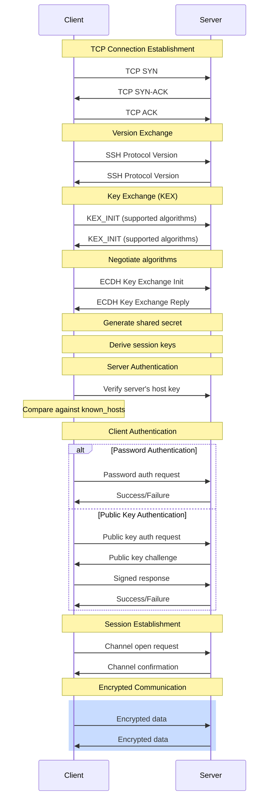

# complete flow of a ssh connection



The SSH connection process is designed as a multi‐stage handshake that not only verifies the identity of the server (and optionally the client) but also negotiates a secure “cryptographic tunnel” over which all subsequent data is exchanged. In this process, the settings you configure for key exchange (KexAlgorithms), symmetric ciphers, and message authentication codes (MACs) determine which algorithms are used at various stages. Below is an overview of how these elements come into play during an SSH session:

***

#### 1. Establishing a TCP Connection and Version Exchange

When an SSH client first connects to a server, it begins with a simple TCP connection. Immediately after, both sides exchange protocol version strings (for example, “SSH-2.0-OpenSSH\_8.0”). This initial exchange confirms that both endpoints speak at least SSH version 2 (the current secure standard) and sets the stage for negotiating the cryptographic algorithms.

***

#### 2. Negotiation of Cryptographic Primitives (SSH\_MSG\_KEXINIT)

After the version exchange, both the client and server send an SSH\_MSG\_KEXINIT message. In these messages, each side advertises the list of algorithms it supports for several categories, including:

* **Key Exchange (KexAlgorithms):** These are the methods (e.g., Diffie‑Hellman variants or Curve25519-based methods) used to establish a shared secret over an insecure network.
* **Ciphers:** These symmetric algorithms (e.g., aes128-ctr, aes256-ctr, chacha20-poly1305) will encrypt all subsequent data once the session keys are established.
* **MACs:** These algorithms (e.g., hmac-sha2-256, hmac-sha2-512) are used to compute a cryptographic checksum for each packet, ensuring data integrity and that no tampering occurred during transit.

Each party’s configuration (typically set in the server’s `/etc/ssh/sshd_config` and the client’s `ssh_config` or `~/.ssh/config`) influences which algorithms are offered. The SSH protocol then selects, for each category, the first algorithm in the client’s list that is also supported by the server.

***

#### 3. The Key Exchange (Kex) Phase

**Role of Kex Algorithms:**\
Once the negotiation is complete, the key exchange algorithm (for example, `curve25519-sha256@libssh.org` or `diffie-hellman-group14-sha256`) is used to securely compute a shared secret. This is done without ever transmitting the secret itself over the network. In the classic Diffie-Hellman method, for instance, both sides generate a temporary private value and exchange corresponding public values; using these and the agreed-upon algorithm, both sides independently compute the same shared secret. This shared secret is the seed for all future keys in the session.

**Key Derivation:**\
From the shared secret, both parties derive several keys using a hash function and some predefined labels. These derived keys include:

* **Encryption Keys:** Used with the negotiated symmetric cipher to encrypt and decrypt data.
* **MAC Keys:** Used with the negotiated MAC algorithm to generate and verify message authentication codes.
* **Initialization Vectors (IVs):** Needed by some ciphers to ensure that the same plaintext never produces the same ciphertext.

***

#### 4. Activation of New Keys and Secure Data Exchange

After key exchange and key derivation, both the client and server send an SSH\_MSG\_NEWKEYS message to signal that they will now use the new keys and the negotiated algorithms for encryption and integrity. From this point on:

* **Encryption (Ciphers):** Every packet is encrypted using the symmetric cipher selected during the negotiation. This ensures confidentiality.
* **Integrity (MACs):** Along with each encrypted packet, a MAC is calculated (using the MAC algorithm and the MAC key) and sent. The recipient recalculates the MAC on the received packet and compares it to the transmitted MAC to verify that the packet has not been modified in transit.

This dual use of encryption and integrity checks protects against eavesdropping and tampering.

***

#### 5. User Authentication and Channel Multiplexing

Once the secure channel is established:

* **Authentication:** The client proceeds with authenticating (using methods like public key authentication or passwords). Because the entire channel is now encrypted and integrity-protected, the authentication data (including signatures when using key pairs) is securely transmitted.
* **Channel Multiplexing:** SSH allows multiple logical channels (for shell sessions, file transfers, port forwarding, etc.) over the same connection. All these channels use the same negotiated session keys and thus benefit from the same protection provided by the ciphers and MACs.

***

#### In Summary

* **Kex Algorithms:** Determine how the client and server establish a shared secret via a secure key exchange. This secret is the basis for generating all other session keys.
* **Ciphers:** Define the method used to encrypt the actual data exchanged after the handshake.
* **MACs:** Ensure that every packet of data is accompanied by an integrity check, protecting against modifications in transit.

Together, these settings form the cryptographic backbone of the SSH protocol. They are negotiated during the initial handshake and then used to secure every subsequent byte of data, ensuring confidentiality, integrity, and, with the help of authentication, trust between the client and server.

For a deeper dive into each step of the SSH handshake and how these cryptographic components are used, you can refer to both the detailed DigitalOcean guide (citeturn1search1) and the SSH protocol specifications on Wikipedia (citeturn1search10).
