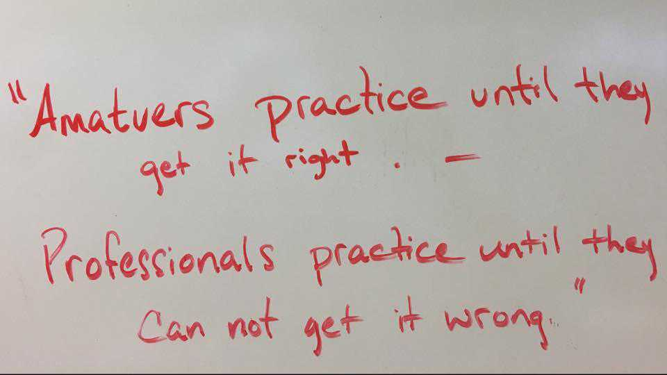

# Motivation



Flow is the mental state of operation in which a person performing an activity is fully immersed in a feeling of energized focus, full involvement, and enjoyment in the process of the activity.

