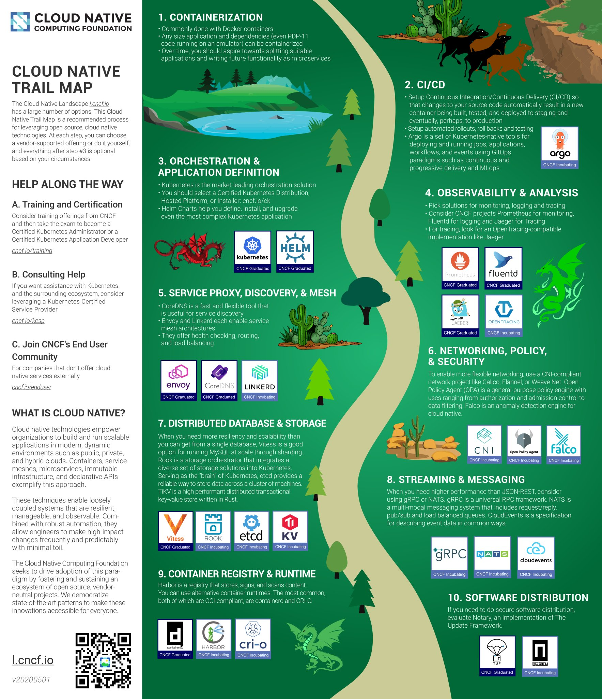

# Whats Cloud Native?

A cloud native application is designed to run on a cloud native infrastructure platform with the following four key traits:

* **Cloud native applications are resilient**. Resiliency is achieved when failures are treated as the norm rather than something to be avoided. The application takes advantage of the dynamic nature of the platform and should be able to recover from failure.
* **Cloud native applications are agile**. Agility allows the application to be deployed quickly with short iterations. Often this requires applications to be written as microservices rather than monolith&#x73;**, but having microservices is not a requirement for cloud native applications.**
* **Cloud native applications are operable**. Operability concerns itself with the qualities of a system that make it work well over its lifetime, not just at deployment phase. An operable application is not only reliable from the end-user point of view, but also from the vantage of the operations team. Examples of operable software is one which operates without needing application restarts or server reboots, or hacks and workarounds that are required to keep the software running. Often this means that the application itself should expose a health check in order for the infrastructure it is running on to query the state of the application.
* **Cloud native applications are observable**. Observability provides answers to questions about application state. Operators and engineers should not need to make conjectures about what is going on in the application. Application logging and metrics are key to making this happen.

On a lighter note :smile:



<figure><figcaption></figcaption></figure>

<figure><figcaption></figcaption></figure>

### Roadmap

<figure><figcaption></figcaption></figure>

## more reading



### More Reading

* [https://iximiuz.com/en/posts/making-sense-out-of-cloud-native-buzz/](https://iximiuz.com/en/posts/making-sense-out-of-cloud-native-buzz/)
* https://www.aquasec.com/cloud-native-academy
*   **cloudnative basics:**

    * https://landscape.cncf.io
    * https://cloudnative101.dev/concepts/cloud-native/
    * https://landscape.cncf.io/guide

